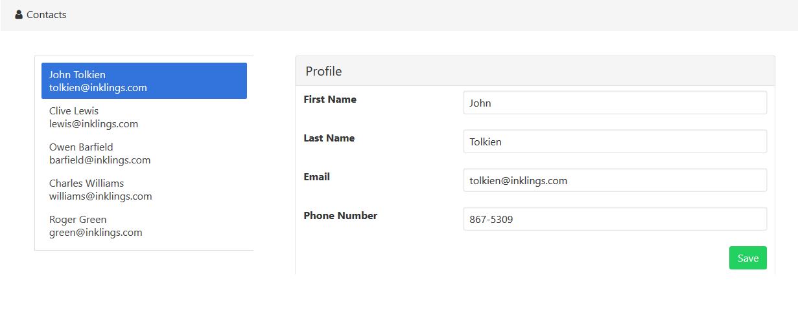
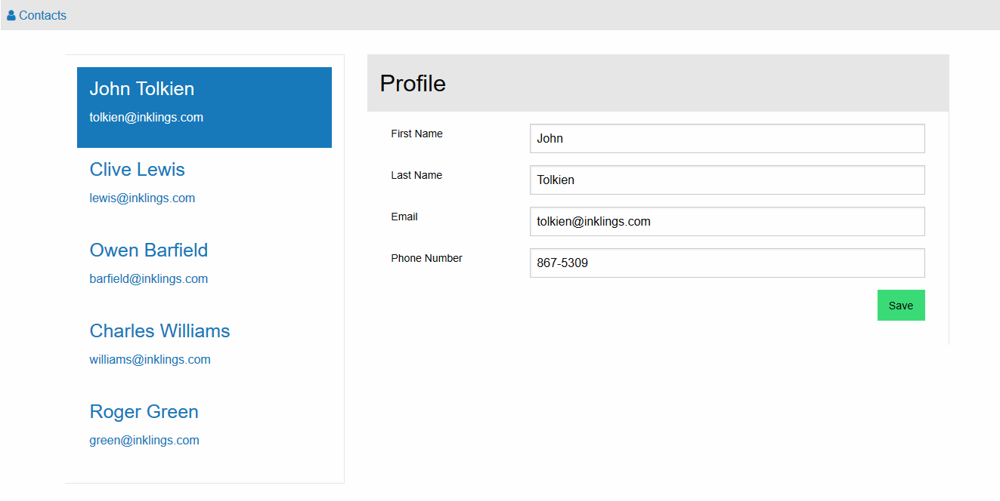
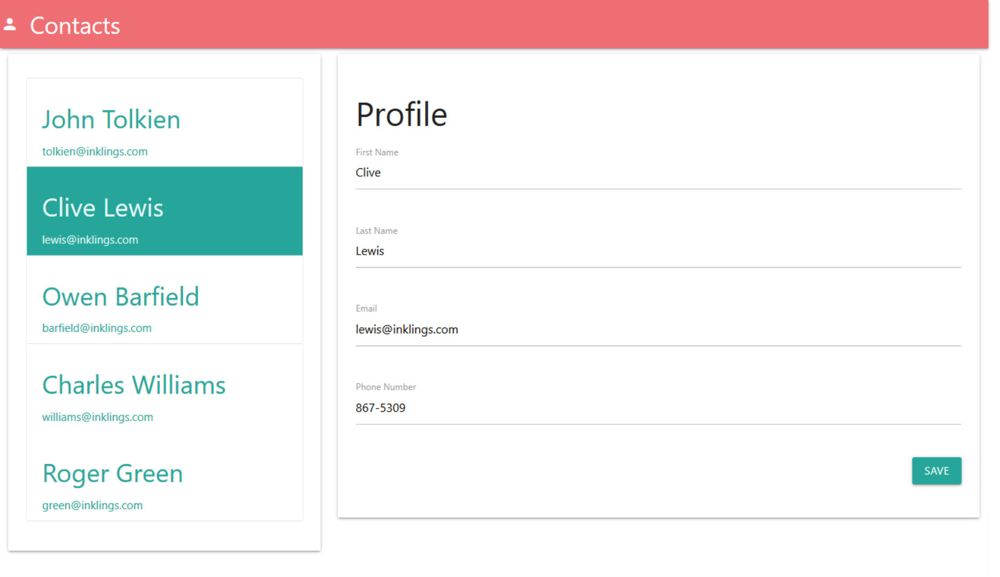
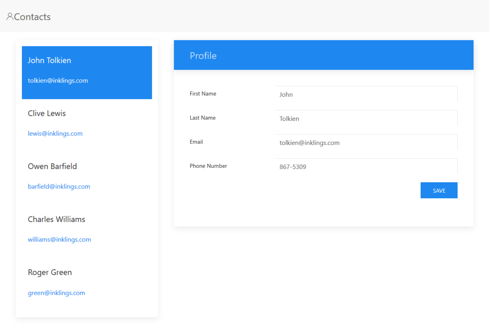

# Contact Manager

The Contact Manager tutorial on aurelia.io uses bootstrap to style the app. Bootstrap is not the 
only Css framework that can be used to build an Aurelia application.

# Bulma

# Foundation for Sites

# Materialize

# UIKit

